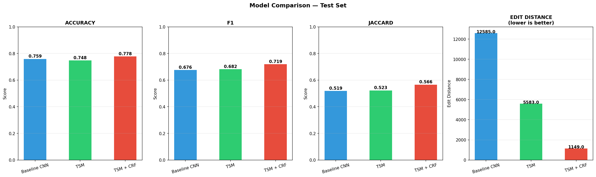
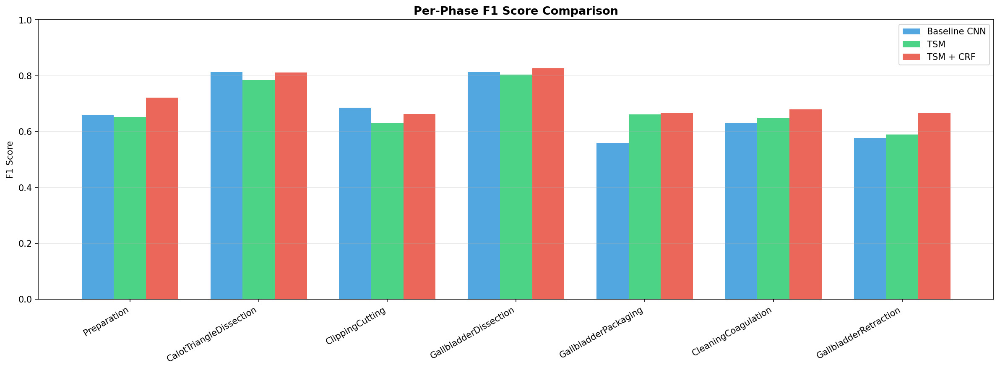
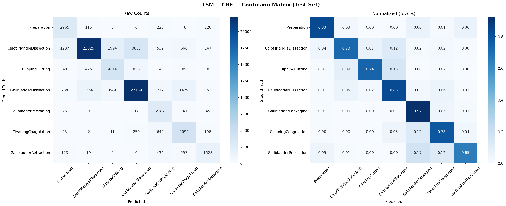
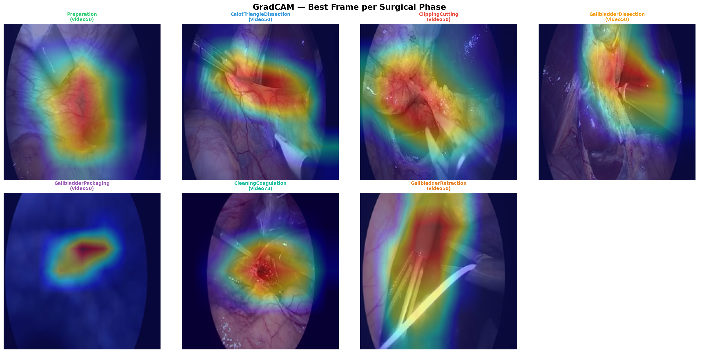
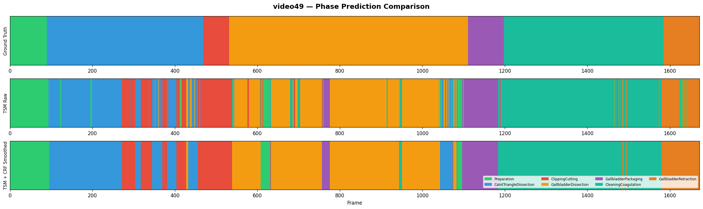

# SurgicalEye: Temporal-Aware Phase Recognition and Explainability for Laparoscopic Video

Built a surgical workflow monitoring system that simultaneously recognises and detects 7 surgical phases and instruments from laparoscopic video using a ResNet50-TSM backbone with Viterbi CRF smoothing, achieving 77.8% accuracy and 91% edit distance reduction on Cholec80, enabling automated surgical documentation, operating room workflow monitoring, and real-time phase duration alerting.

---

## Background and Motivation

Laparoscopic surgery is a minimally invasive surgical technique in which a camera and specialised instruments are introduced through small incisions, enabling surgeons to operate without large open cuts and substantially reducing patient recovery time. Despite generating hours of rich, information-dense video per procedure, this footage remains largely unanalysed and undocumented, representing a significant missed opportunity for clinical quality assurance, surgical education, and workflow optimisation.

This project addresses that gap by developing an end-to-end deep learning pipeline that automatically understands surgical workflow from laparoscopic video, recognising distinct procedural phases, detecting active instruments, enforcing clinically valid phase sequences through probabilistic smoothing, and providing anatomically grounded attention visualisations to support clinical interpretability. Trained and evaluated on the Cholec80 benchmark of 80 fully annotated laparoscopic cholecystectomy procedures, the system demonstrates the feasibility of automated surgical documentation, operating room workflow monitoring, real-time phase duration alerting, and lays the groundwork for context-aware robotic surgical assistance.

---

## Dataset and Preprocessing

The Cholec80 dataset comprises 80 laparoscopic cholecystectomy videos recorded at 25 frames per second, annotated with frame-level surgical phase labels across 7 phases and binary instrument presence labels for 7 instrument classes. The dataset follows a standard split of videos 1 to 40 for training, 41 to 48 for validation, and 49 to 80 for testing, yielding 86,344 training frames, 21,445 validation frames, and 76,789 test frames.

Preprocessing involved extracting frames at 1 frame per second, reducing the dataset to a computationally tractable scale whilst preserving sufficient temporal resolution for phase recognition. Extracted frames were resized to 224x224 pixels and normalised using ImageNet mean and standard deviation statistics. Training frames were augmented with random horizontal flipping and colour jitter to improve generalisation. To address the substantial class imbalance inherent in surgical video, where dominant phases such as CalotTriangleDissection occupy significantly more frames than rare phases such as GallbladderRetraction, inverse-frequency class weights were applied to the phase classification loss. For temporal modeling, frames were organised into overlapping sequences of 8 consecutive frames per sample, providing the TSM with sufficient inter-frame context to capture phase transition dynamics.

| # | Phase | Description |
|---|---|---|
| 1 | Preparation | Camera and trocar setup |
| 2 | CalotTriangleDissection | Exposing cystic duct and artery |
| 3 | ClippingCutting | Sealing and cutting the duct and artery |
| 4 | GallbladderDissection | Detaching gallbladder from liver bed |
| 5 | GallbladderPackaging | Placing gallbladder in specimen bag |
| 6 | CleaningCoagulation | Stopping bleeding and cleaning liver bed |
| 7 | GallbladderRetraction | Removing bagged gallbladder through trocar |

*Table 1: Surgical Phases and Descriptions*

| # | Instrument | Surgical Role |
|---|---|---|
| 1 | Grasper | Holds and manipulates tissue and organs during dissection |
| 2 | Bipolar | Applies electrical current to coagulate bleeding vessels |
| 3 | Hook | Primary dissection tool for cutting and cauterising tissue |
| 4 | Scissors | Cuts tissue and structures with mechanical precision |
| 5 | Clipper | Applies surgical clips to seal cystic duct and artery |
| 6 | Irrigator | Flushes the operative field to remove blood and debris |
| 7 | SpecimenBag | Encloses the resected gallbladder for safe extraction |

*Table 2: Surgical Instruments and Their Roles*

| Split | Videos | Frames | Phase Labels | Tool Labels |
|---|---|---|---|---|
| Train | 40 (1-40) | 86,344 | 7 phases | 7 instruments |
| Validation | 8 (41-48) | 21,445 | 7 phases | 7 instruments |
| Test | 32 (49-80) | 76,789 | 7 phases | 7 instruments |
| Total | 80 | 184,578 | 7 phases | 7 instruments |

*Table 3: Dataset Summary*

| Step | Detail |
|---|---|
| Frame extraction | 1fps (from 25fps source) |
| Image resolution | 224x224 pixels |
| Normalisation | ImageNet mean and standard deviation |
| Augmentation | Random horizontal flip, colour jitter |
| Class imbalance | Inverse-frequency phase loss weighting |
| Sequence length | 8 consecutive frames per sample |
| Sequence stride | 8 frames (no overlap) |

*Table 4: Preprocessing Summary*

> Request dataset access: [camma.unistra.fr/datasets](http://camma.u-strasbg.fr/datasets)

---

## Pipeline Architecture

The system follows a four-stage processing pipeline designed to progressively transform raw laparoscopic video frames into temporally consistent, interpretable surgical phase predictions. A pretrained ResNet50 convolutional backbone was selected as the visual feature extractor due to its strong generalisation from ImageNet pretraining, computational efficiency within the 8GB VRAM constraint, and proven performance on medical imaging tasks. Rather than treating each frame independently, the backbone is augmented with a Temporal Shift Module (TSM), which addresses a fundamental limitation of standard CNNs — their inability to reason across time.

TSM works by physically shifting a fraction of feature channels from the current frame to its neighbouring frames before the convolution operation. Concretely, for a sequence of 8 frames processed together, a portion of channels from frame t are replaced with channels from frame t-1 (past context) and frame t+1 (future context) before each residual block. This allows the convolution to implicitly see information from adjacent frames without any additional parameters or architectural changes, making it significantly more efficient than 3D convolutions or recurrent networks. The result is a model that understands not just what a single frame looks like, but how the surgical scene is evolving over time, which is critical for distinguishing visually similar phases such as CalotTriangleDissection and GallbladderDissection.

The temporally enriched features are passed to two parallel output heads that simultaneously predict surgical phase and instrument presence, a multi-task design that encourages the shared backbone to learn features relevant to both objectives, improving generalisation over single-task alternatives. Following inference, raw frame-level predictions are post-processed by a Viterbi CRF smoother, which uses a learned phase transition matrix to enforce clinically valid phase ordering. Surgery cannot jump from phase 2 to phase 6 without passing through phases 3, 4, and 5. Finally, GradCAM generates gradient-weighted attention maps by computing the gradient of the predicted class score with respect to the final convolutional feature maps, producing spatially localised heatmaps that highlight which anatomical regions drove each prediction and providing the interpretability essential for clinical trust.

| Component | Detail |
|---|---|
| Backbone | ResNet50 pretrained on ImageNet |
| Temporal Module | Temporal Shift Module (TSM), n_segment=8 |
| Phase Head | Linear(2048 to 512) ReLU Linear(512 to 7) |
| Tool Head | Linear(2048 to 512) ReLU Linear(512 to 7) |
| Dropout | 0.5 on both heads and backbone output |
| Loss Phase | Weighted CrossEntropyLoss x 2.0 |
| Loss Tool | BCEWithLogitsLoss x 1.0 |
| Optimizer | Adam (backbone lr=1e-4, heads lr=3e-4) |
| Scheduler | ReduceLROnPlateau (factor=0.5, patience=3) |
| Batch size | 8 sequences of 8 frames |
| Hardware | NVIDIA RTX 4060 Laptop 8GB VRAM |
| Precision | Mixed precision AMP fp16 |

*Table 5: Model Architecture*

---

## Results

All models were evaluated on the held-out test set comprising 32 videos and 76,789 frames never seen during training or validation. Results demonstrate progressive improvement across accuracy, F1, Jaccard index, and temporal edit distance as each component is added to the pipeline.

| Model | Accuracy | F1 Score | Jaccard | Edit Distance |
|---|---|---|---|---|
| Baseline CNN (ResNet50) | 75.9% | 0.676 | 0.519 | 12,585 |
| + TSM | 74.8% | 0.682 | 0.523 | 5,583 |
| + TSM + CRF (final) | **77.8%** | **0.719** | **0.566** | **1,149** |

*Table 6: Overall Performance Comparison — Test Set*

The baseline CNN achieves a competitive 75.9% accuracy, demonstrating that frame-level visual features alone carry substantial discriminative power for surgical phase recognition. The addition of TSM marginally reduces raw accuracy whilst improving F1 and Jaccard, suggesting that temporal context helps the model generalise across phase boundaries rather than memorising dominant frame appearances.

The most significant contribution comes from the Viterbi CRF smoother, which reduces edit distance by 91% from 12,585 to 1,149, producing substantially more clinically realistic phase sequences. This result underscores a key insight: for surgical workflow monitoring, temporal coherence is arguably more clinically meaningful than raw frame accuracy, as a system producing erratic phase predictions would be unusable in practice regardless of its per-frame score.

*Figure 1: Model Comparison — Accuracy, F1, Jaccard and Edit Distance*

| Phase | Precision | Recall | F1 |
|---|---|---|---|
| Preparation | 0.64 | 0.83 | 0.72 |
| CalotTriangleDissection | 0.92 | 0.73 | 0.81 |
| ClippingCutting | 0.60 | 0.74 | 0.66 |
| GallbladderDissection | 0.82 | 0.83 | **0.83** |
| GallbladderPackaging | 0.52 | **0.92** | 0.67 |
| CleaningCoagulation | 0.60 | 0.78 | 0.68 |
| GallbladderRetraction | 0.68 | 0.65 | 0.67 |

*Table 7: Per-Phase Performance — TSM + CRF*

GallbladderDissection achieves the strongest F1 of 0.83, consistent with its dominance in training data and visually distinctive anatomical appearance. GallbladderRetraction remains the most challenging phase at 0.67, attributable to its limited representation in the dataset and visual similarity to CleaningCoagulation in later surgical frames.

The high recall of 0.92 for GallbladderPackaging reflects the visually distinctive appearance of the specimen bag, making it reliably detectable despite limited training examples. CalotTriangleDissection achieves the highest precision of 0.92, indicating that when the model predicts this phase it is almost always correct, though it tends to under-predict it with a recall of 0.73, likely due to confusion with visually similar dissection phases.

Overall, the per-phase breakdown reveals that class imbalance and visual similarity between adjacent phases remain the primary sources of error, both of which are natural targets for future work involving larger temporal windows and data augmentation strategies.

*Figure 2: Per-Phase F1 Score Comparison Across All Three Models*

*Figure 3: TSM + CRF Confusion Matrix — Test Set*

---

## GradCAM Explainability

A key requirement for clinical adoption of surgical AI systems is interpretability. Clinicians must be able to understand and verify why a model makes a particular prediction before trusting it in practice. This project addresses that requirement through GradCAM (Gradient-weighted Class Activation Mapping), which computes the gradient of the predicted class score with respect to the final convolutional feature maps and produces spatially localised heatmaps highlighting the anatomical regions that drove each prediction.

GradCAM was applied to the best-performing test videos, generating per-phase attention overlays that reveal distinct and anatomically meaningful attention patterns across all seven surgical phases. During CalotTriangleDissection, the model correctly attends to the dissection site where the hook instrument meets tissue. During ClippingCutting, attention broadens across the clip applicator and surrounding anatomy. During GallbladderPackaging, the model reliably focuses on the specimen bag, consistent with its high recall of 0.92. These patterns confirm that the model is learning clinically meaningful visual features rather than exploiting spurious correlations in the data.

Beyond static images, GradCAM was applied frame by frame to generate a full video overlay for video73, the strongest performing test case. Each frame displays the GradCAM heatmap blended with the original surgical footage at 45% opacity, preserving full anatomical visibility whilst communicating model attention. Phase predictions, confidence scores, and detected instruments are displayed in real time at the bottom of each frame, producing a clinically interpretable visualisation of the complete surgical workflow as understood by the model.

*Figure 4: GradCAM — Best Frame per Surgical Phase*

## Demo

The SurgicalEye pipeline is packaged as an interactive Gradio web application. 

Upon uploading a laparoscopic video, the interface presents four complementary outputs that together communicate the full analytical capability of the pipeline. The GradCAM overlay video renders the original surgical footage with a real-time attention heatmap blended at 45% opacity, displaying the predicted surgical phase in its corresponding colour, a confidence bar reflecting prediction certainty, and the set of instruments detected at each frame, providing a frame-by-frame interpretable account of surgical workflow as understood by the model.

The phase timeline panel displays two colour-coded bars spanning the full video duration: the upper bar shows raw TSM predictions and the lower bar shows CRF smoothed predictions, making the temporal coherence improvement immediately visible and intuitive. The tool detection heatmap displays instrument presence probability across time as a colour-coded matrix, revealing patterns of instrument use across the surgical procedure. Finally, the analysis summary identifies the dominant surgical phase, all phases detected, and total frames processed, providing a concise clinical overview of the procedure.

*Figure 5: SurgicalEye Gradio Demo — GradCAM Overlay, Phase Timeline and Tool Detection*

*Figure 6: Phase Timeline — TSM Raw vs CRF Smoothed*

---

## Key Findings

1. **Temporal context matters but is not sufficient alone.** The addition of TSM to the ResNet50 backbone improves F1 and Jaccard scores but marginally reduces raw accuracy, indicating that temporal modeling helps the model generalise across phase boundaries rather than memorising dominant frame appearances. The real benefit of temporal context becomes apparent in the edit distance reduction from the baseline, confirming that the model produces more coherent phase sequences when neighbouring frames inform each prediction.

2. **Post-processing is as important as the model itself.** The Viterbi CRF smoother contributes the single largest performance gain in the pipeline, reducing edit distance by 91% without any additional training. This finding highlights that in clinical sequential prediction tasks, enforcing domain knowledge through structured post-processing can be more impactful than architectural complexity alone.

3. **Class imbalance remains a fundamental challenge.** Phases with limited training representation such as GallbladderRetraction consistently underperform relative to dominant phases such as GallbladderDissection and CalotTriangleDissection, despite inverse-frequency loss weighting. This suggests that data augmentation strategies, synthetic data generation, or few-shot learning approaches targeting rare phases would be a productive direction for future work.

4. **GradCAM confirms clinical validity.** Attention heatmaps consistently highlight anatomically meaningful regions across all seven phases, providing qualitative evidence that the model is learning genuine surgical visual features rather than exploiting dataset artefacts or background correlations.

5. **Multi-task learning is beneficial.** Jointly predicting phases and instruments from a shared backbone improves generalisation over single-task alternatives, as the instrument detection objective encourages the backbone to attend to tool regions that are also highly discriminative for phase recognition.

6. **Edit distance is the most clinically meaningful metric.** Raw accuracy alone is a misleading indicator of clinical utility for sequential prediction tasks. A model achieving 75% accuracy but producing 12,585 erratic phase transitions is far less useful than one achieving 77.8% with only 1,149 transitions, underscoring the importance of temporal evaluation metrics in surgical AI benchmarking.

---

## Limitations and Future Work

### Limitations

1. **Class imbalance.** Despite inverse-frequency loss weighting, rare phases such as GallbladderRetraction and CleaningCoagulation remain underperforming relative to dominant phases, reflecting the natural distribution of surgical video data where certain phases occupy substantially fewer frames.

2. **Short temporal window.** The TSM operates on sequences of 8 frames extracted at 1fps, providing only 8 seconds of temporal context. Longer surgical procedures with gradual phase transitions may benefit from larger temporal windows or hierarchical temporal modeling approaches.

3. **Single dataset.** The system was trained and evaluated exclusively on Cholec80, which contains laparoscopic cholecystectomy procedures from a single institution. Generalisation to other surgical procedures, institutions, or camera systems has not been evaluated.

4. **Tool detection is binary.** The current system predicts instrument presence as a binary label per frame rather than localising instruments spatially. This limits the granularity of tool-related analysis and precludes direct instrument tracking applications.

5. **Inference speed.** The current pipeline processes video at approximately 1 frame per second on an NVIDIA RTX 4060 laptop GPU, which is insufficient for true real-time deployment without architectural optimisation or dedicated hardware.

### Future Work

1. **Larger temporal context.** Replacing TSM with full video transformers such as TimeSformer or Video Swin Transformer to capture longer range temporal dependencies across complete surgical procedures.

2. **Instrument localisation.** Extending the tool detection head to predict bounding boxes or segmentation masks, enabling spatial instrument tracking rather than binary presence detection.

3. **Cross-dataset generalisation.** Evaluating and fine-tuning the pipeline on additional surgical datasets such as Endoscapes and m2cai16 to assess and improve generalisation across procedures and institutions.

4. **Uncertainty estimation.** Incorporating calibrated uncertainty quantification through Monte Carlo Dropout or conformal prediction to provide clinicians with reliable confidence intervals alongside predictions.

5. **Real-time optimisation.** Applying model distillation, quantisation, and TensorRT deployment to achieve real-time inference suitable for intraoperative use.

6. **Online learning.** Exploring continual learning approaches that allow the model to adapt to new surgeons, institutions, and procedure variations without catastrophic forgetting of previously learned surgical knowledge.

---

## References

1. Twinanda et al. (2017). EndoNet: A Deep Architecture for Recognition Tasks on Laparoscopic Videos. IEEE Transactions on Medical Imaging.
2. He et al. (2016). Deep Residual Learning for Image Recognition. CVPR 2016.
3. Lin et al. (2019). TSM: Temporal Shift Module for Efficient Video Understanding. ICCV 2019.
4. Selvaraju et al. (2017). Grad-CAM: Visual Explanations from Deep Networks via Gradient-based Localization. ICCV 2017.

---

## Author

Navin Bondade
MSc Health Data Science, University College London

[GitHub](https://github.com/NavinBondade) · [LinkedIn](https://linkedin.com/in/navin-bondade)
